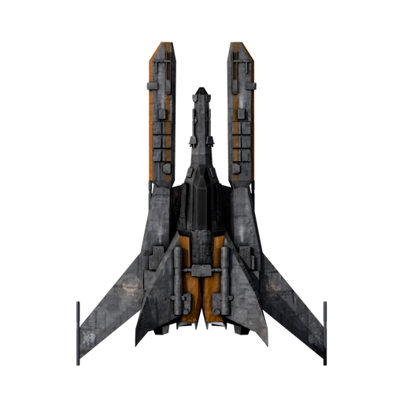
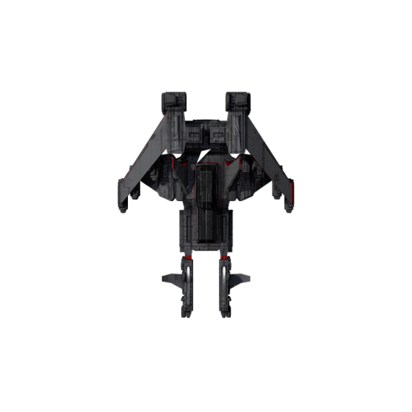
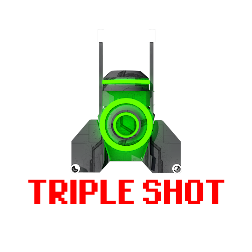

# Space Shooter

Welcome to **Space Shooter**, a Unity 2D arcade-style shooter project created while learning from the **Udemy** course:

https://www.udemy.com/share/101XAE3@8saDdqmNAvWvHNae7RGPz719ck22-KffyblTNdX6GAIbIzTAZwCUp6I0chAH22rZEQ==/

This project demonstrates core Unity gameplay systems including player movement, shooting, enemy spawning, power-ups, and simple game flow management.

---

## Game Overview

In this game, the player controls a spaceship that can move freely inside a defined play area. Enemies spawn from the top of the screen and move downward. The player must avoid enemies while firing lasers to survive.

### Main mechanics

- Player movement with `WASD` or arrow keys
- Shoot lasers with `Space`
- Collect power-ups to activate:
  - **Triple Shot** — fires three lasers at once
  - **Speed Boost** — temporarily increases player movement speed
- Player starts with **3 lives**
- Game ends when player health reaches zero

### What you learn from this project

- Unity C# scripting with `MonoBehaviour`
- Collision detection using `OnTriggerEnter2D`
- Coroutines for timed effects and spawning
- Prefab instantiation for enemies and power-ups
- Simple game state logic and object respawning

---

## How to install and run on PC

### Requirements

- Unity Editor compatible with this project version: **2024.1.0f1** (see `ProjectSettings/ProjectVersion.txt`)
- Unity Hub installed
- Windows PC or macOS with Unity Editor installed

### Setup steps

1. Open **Unity Hub**.
2. Click **Add** and select the project folder:
   - `/Users/pradeepkumar0987/Desktop/Unity Projects/Space Shooter`
3. Open the project in Unity.
4. In Unity, go to **File > Build Settings**.
5. Select **PC, Mac & Linux Standalone**.
6. Add the main scene(s) from `Assets/Scenes` if they are not already listed.
7. Click **Build** and choose a destination folder for the standalone player.
8. Run the built executable from the output folder.

### Play the game

- Move: `W`, `A`, `S`, `D` or arrow keys
- Fire: `Space`
- Collect power-ups to gain temporary advantages

---

## Gameplay elements

### Player

The player spaceship can move across the screen boundaries and shoot lasers. It can collect power-ups to fire triple shots and gain speed.

### Enemy

Enemies spawn from the top and move downward. If an enemy collides with the player, the player loses a life. The spawn manager continually spawns enemies until the player dies.

### Power-up

Power-ups appear randomly and grant bonuses like triple shot or speed boost for a short time.

---

## Repository notes

The repository includes the Unity project files needed to open and edit the game. Some folders are generated by Unity and should not be committed to version control.

### Ignored folders in this project

- `Library/`
- `Temp/`
- `Obj/`
- `Logs/`
- `MemoryCaptures/`
- `UserSettings/`
- `Build/` or `Builds/`

These folders are excluded in `.gitignore` because they are generated by Unity and can be rebuilt automatically.

---

## Project structure

- `Assets/` — game assets, scripts, prefabs, scenes, audio, and sprites
- `ProjectSettings/` — Unity project configuration
- `Packages/` — Unity package dependencies
- `README.md` — project documentation
- `.gitignore` — rules for files and folders not tracked by Git

---

## Notes

This project was built as part of learning Unity game development from a Udemy course. It is a simple but complete example of a 2D shooter and a good starting point for adding more features.

---

## Development Status

- **State**: Under active bug-fixing and polishing; the project is currently a single-player game.
- **Scenes / flow**: Main menu loads the gameplay scene using scene indices. See [Assets/Scripts/MainManu.cs](Assets/Scripts/MainManu.cs) and [Assets/Scripts/GameManager.cs](Assets/Scripts/GameManager.cs).

## Key Features (summary)

- **Player**: movement with WASD / arrow keys, shooting, lives, visual damage indicators, and scoring — see [Assets/Scripts/Player.cs](Assets/Scripts/Player.cs).
- **Power-ups**: Triple Shot, Speed Boost, Shield with timed effects — see [Assets/Scripts/PowerUp.cs](Assets/Scripts/PowerUp.cs).
- **Enemies & Asteroids**: spawning, downward movement, explosions, and enemy lasers — see [Assets/Scripts/SpawnManager.cs](Assets/Scripts/SpawnManager.cs), [Assets/Scripts/Enemy.cs](Assets/Scripts/Enemy.cs), [Assets/Scripts/Asteroid.cs](Assets/Scripts/Asteroid.cs).
- **UI & Flow**: score and lives display, game-over screen and restart instructions — see [Assets/Scripts/UIManager.cs](Assets/Scripts/UIManager.cs) and [Assets/Scripts/GameManager.cs](Assets/Scripts/GameManager.cs).
- **Audio & Animations**: audio clips and animator controllers are used across player, enemies, asteroids, and power-ups (see `Assets/Animations/` and individual scripts).

## Known Issues (work in progress)

- **Audio assignment in Asteroid**: `Asteroid.cs` checks `_audioSource` but does not assign it with `GetComponent<AudioSource>()` in Start; this can cause missing audio or null warnings. See [Assets/Scripts/Asteroid.cs](Assets/Scripts/Asteroid.cs).
- **Spawn parent / inspector nulls**: `SpawnManager` assigns spawned enemies to `_enemyContainer.transform` — ensure `_enemyContainer` is set in the inspector to avoid NullReferenceExceptions. See [Assets/Scripts/SpawnManager.cs](Assets/Scripts/SpawnManager.cs).
- **Lives sprite indexing**: `UIManager` uses `_liveSprites[playerLives]` without bounds checks; incorrect array sizes could cause index errors. See [Assets/Scripts/UIManager.cs](Assets/Scripts/UIManager.cs).
- **Hard-coded scene indices**: `GameManager` and `MainManu` use numeric scene indices; changing build order can break scene loading. Consider using scene names or constants.
- **Input system mismatch**: the project contains new Input System assets, but scripts use the legacy `Input` API — decide and standardize the input approach.
- **Obsolete attributes/warnings**: several methods are marked with `[System.Obsolete]` which may indicate API or editor-version mismatches to tidy up.

## Next Steps / TODO

- Fix the simple null/assignment issues (e.g., assign `AudioSource` in `Asteroid`, add inspector-null checks in `SpawnManager`).
- Add bounds checks for UI arrays and safer scene-loading (use names or constants).
- Decide on input system (legacy vs new) and refactor input handling accordingly.
- Playtest and iterate on audio/visual polish and performance; optionally add multiplayer later.

If you'd like, I can apply the quick code fixes for the obvious issues now (AudioSource assignment and null checks). Just tell me which fixes to apply.